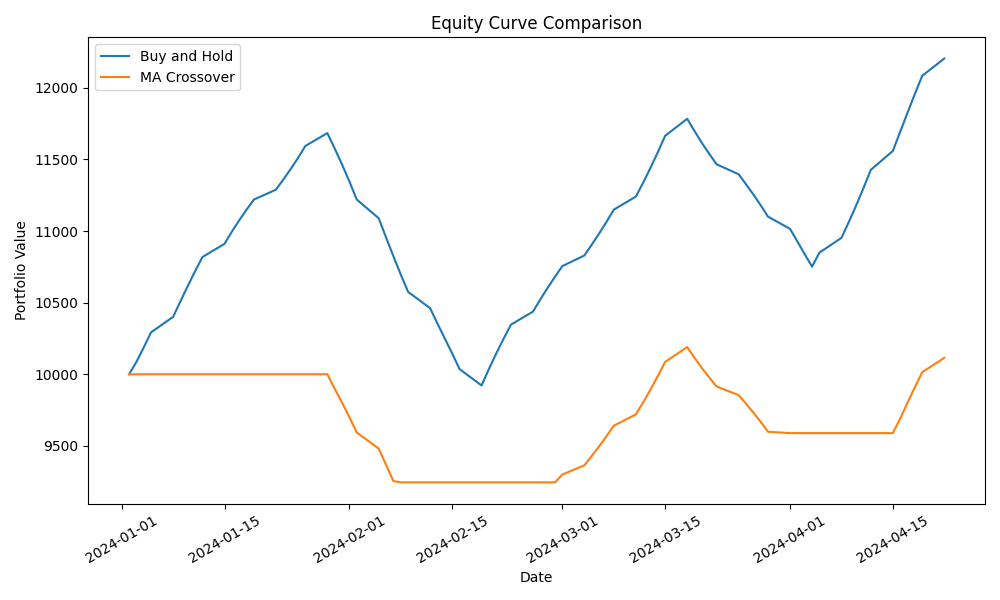
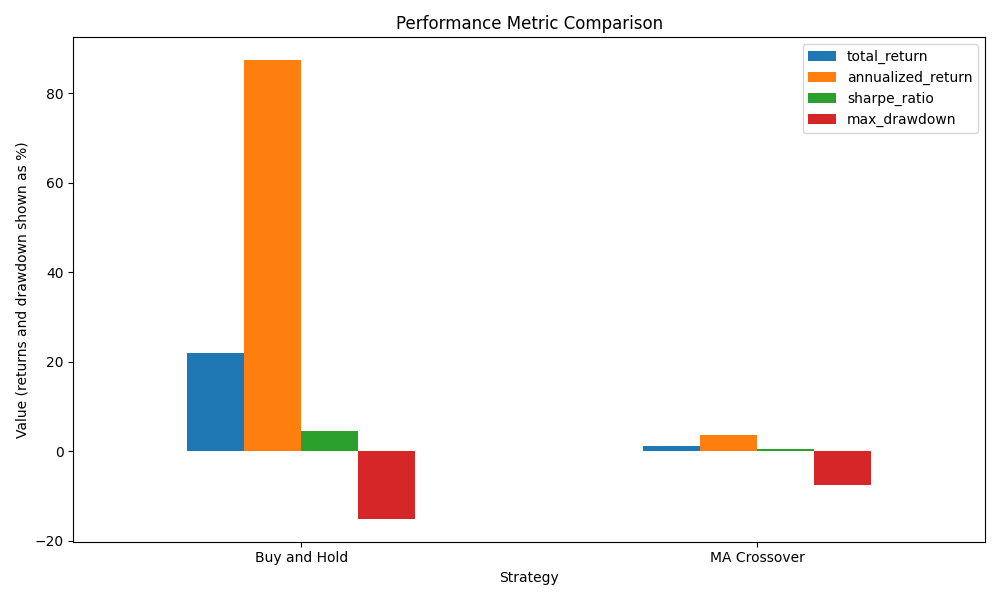

# tradelab

This repo is for my final project.

I built a simple modular Python backtesting project for trading strategies. The project solves a straightforward problem: it lets a user take price data in CSV form, test a small set of rule-based strategies on that data, and compare those strategies against a buy-and-hold benchmark.

## What the project does

The program:

- loads price data from a CSV file
- validates the required columns
- cleans the data
- calculates simple indicators and features
- generates trading signals
- runs a simple long-only backtest
- calculates performance metrics
- saves output tables and plots

## Strategies included

- Buy and Hold
- Moving Average Crossover

## Inputs

The input is a CSV file with these columns:

- `date`
- `open`
- `high`
- `low`
- `close`
- `volume`

A sample file is included at:

- `data/sample_prices.csv`

## Outputs

Running the project creates these files in `outputs/`:

- `processed_prices.csv`
- `buy_and_hold_results.csv`
- `ma_crossover_results.csv`
- `performance_summary.csv`
- `equity_curve.png`
- `metric_comparison.png`

## Example output

When I run the sample input file, the performance summary looks like this:

| Strategy | Total Return | Annualized Return | Annualized Volatility | Sharpe Ratio | Max Drawdown |
|---|---:|---:|---:|---:|---:|
| Buy and Hold | 17.91% | 68.03% | 19.34% | 2.78 | -11.16% |
| MA Crossover | 6.57% | 22.19% | 13.98% | 1.50 | -7.03% |

## Example visuals

### Equity curve comparison



### Metric comparison chart



## Project structure

```text
tradelab/
├── README.md
├── requirements.txt
├── main.py
├── data/
│   └── sample_prices.csv
├── outputs/
│   ├── processed_prices.csv
│   ├── buy_and_hold_results.csv
│   ├── ma_crossover_results.csv
│   ├── performance_summary.csv
│   ├── equity_curve.png
│   └── metric_comparison.png
├── src/
│   ├── data_loader.py
│   ├── cleaner.py
│   ├── features.py
│   ├── backtester.py
│   ├── metrics.py
│   ├── plotting.py
│   └── strategies/
│       ├── buy_and_hold.py
│       └── ma_crossover.py
└── tests/
    ├── test_loader.py
    ├── test_cleaner.py
    ├── test_features.py
    ├── test_strategies.py
    ├── test_backtester.py
    └── test_metrics.py

## Use of generative AI

I used generative AI tools as a support tool during the development of this project.

These tools helped me:
- organise the repository and file structure
- think through how to break the project into clear modules
- debug syntax errors, import issues, and file path problems
- improve documentation in the README


## How to run the code

From the top-level project folder, run:

```bash
python3 -m pip install -r requirements.txt
python3 main.py
python3 -m pytest
